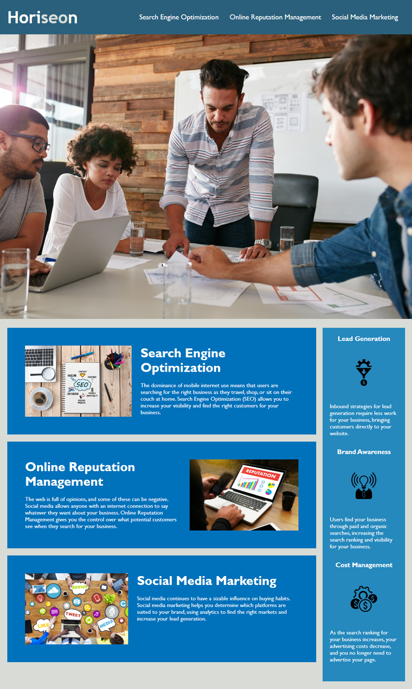

# 01 HTML, CSS, and Git: Code Refactor

## Description

The ne HOriseon website that meets accessibility standarts ad has semantic HTML elements. I updated the images to contain description all tags.

## Screenshots

## Links to Application

- Here is a repo [https://github.com/slowsonic/hw1b]
- Here is a page [https://slowsonic.github.io/hw1b/]
